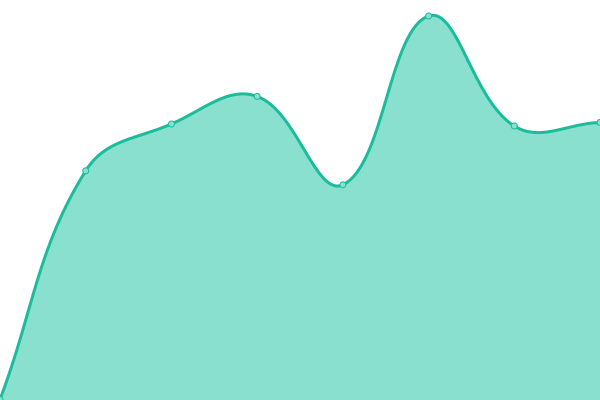

# [📈 Live Status](https://fwten.github.io/hxgl-upptime): <!--live status--> **🟩 All systems operational**

This repository contains the open-source uptime monitor and status page for [Upptime](https://upptime.js.org), powered by [Upptime](https://github.com/upptime/upptime).

With [Upptime](https://upptime.js.org), you can get your own unlimited and free uptime monitor and status page, powered entirely by a GitHub repository. We use [Issues](https://github.com/upptime/upptime/issues) as incident reports, [Actions](https://github.com/fwten/hxgl-upptime/actions) as uptime monitors, and [Pages](https://upptime.github.io/upptime) for the status page.

<!--start: status pages-->
<!-- This summary is generated by Upptime (https://github.com/upptime/upptime) -->
<!-- Do not edit this manually, your changes will be overwritten -->
<!-- prettier-ignore -->
| URL | Status | History | Response Time | Uptime |
| --- | ------ | ------- | ------------- | ------ |
|  [HX GitLab](https://healthx-gitlab.bihealth.org/) | 🟩 Up | [hx-git-lab.yml](https://github.com/fwten/hxgl-upptime/commits/HEAD/history/hx-git-lab.yml) | 

 1124ms
     
 | 

<a href="https://fwten.github.io/hxgl-upptime/history/hx-git-lab">100.00%</a>
    

|  de.NBI LLM | 🟩 Up | [de-nbi-llm.yml](https://github.com/fwten/hxgl-upptime/commits/HEAD/history/de-nbi-llm.yml) | 

 655ms
     
 | 

<a href="https://fwten.github.io/hxgl-upptime/history/de-nbi-llm">100.00%</a>
    

|  de.NBI LLM API | 🟩 Up | [de-nbi-llm-api.yml](https://github.com/fwten/hxgl-upptime/commits/HEAD/history/de-nbi-llm-api.yml) | 

 122ms
     
 | 

<a href="https://fwten.github.io/hxgl-upptime/history/de-nbi-llm-api">100.00%</a>
    

<!--end: status pages-->

[**Visit our status website →**](https://fwten.github.io/hxgl-upptime)

## 📄 License

- Powered by: [Upptime](https://github.com/upptime/upptime)
- Code: [MIT](./LICENSE) © [Anand Chowdhary](https://anandchowdhary.com), supported by [Pabio](https://pabio.com)
- Data in the `./history` directory: [Open Database License](https://opendatacommons.org/licenses/odbl/1-0/)
