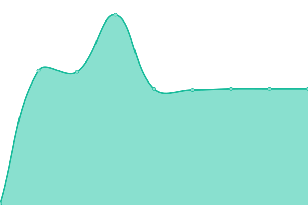
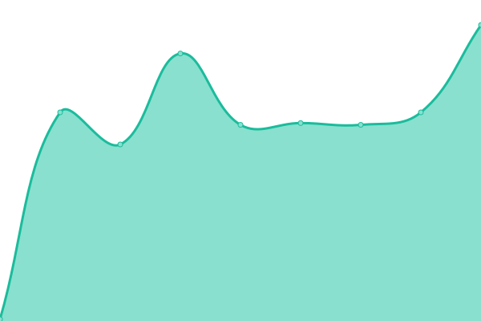

# [📈 Live Status](https://fwten.github.io/hxgl-upptime): <!--live status--> **🟧 Partial outage**

This repository contains the open-source uptime monitor and status page for [Upptime](https://upptime.js.org), powered by [Upptime](https://github.com/upptime/upptime).

With [Upptime](https://upptime.js.org), you can get your own unlimited and free uptime monitor and status page, powered entirely by a GitHub repository. We use [Issues](https://github.com/upptime/upptime/issues) as incident reports, [Actions](https://github.com/fwten/hxgl-upptime/actions) as uptime monitors, and [Pages](https://upptime.github.io/upptime) for the status page.

<!--start: status pages-->
<!-- This summary is generated by Upptime (https://github.com/upptime/upptime) -->
<!-- Do not edit this manually, your changes will be overwritten -->
<!-- prettier-ignore -->
| URL | Status | History | Response Time | Uptime |
| --- | ------ | ------- | ------------- | ------ |
|  [HX GitLab](https://healthx-gitlab.bihealth.org/) | 🟩 Up | [hx-git-lab.yml](https://github.com/fwten/hxgl-upptime/commits/HEAD/history/hx-git-lab.yml) | 

 1085ms
     
 | 

<a href="https://fwten.github.io/hxgl-upptime/history/hx-git-lab">100.00%</a>
    

|  NFS Tar | 🟩 Up | [nfs-tar.yml](https://github.com/fwten/hxgl-upptime/commits/HEAD/history/nfs-tar.yml) | 

 792ms
     
 | 

<a href="https://fwten.github.io/hxgl-upptime/history/nfs-tar">100.00%</a>
    

|  Aspera Conf | 🟩 Up | [aspera-conf.yml](https://github.com/fwten/hxgl-upptime/commits/HEAD/history/aspera-conf.yml) | 

 112ms
     
 | 

<a href="https://fwten.github.io/hxgl-upptime/history/aspera-conf">100.00%</a>
    

|  Aspera Tar | 🟩 Up | [aspera-tar.yml](https://github.com/fwten/hxgl-upptime/commits/HEAD/history/aspera-tar.yml) | 

 112ms
     
 | 

<a href="https://fwten.github.io/hxgl-upptime/history/aspera-tar">100.00%</a>
    

|  NFS Disk | 🟩 Up | [nfs-disk.yml](https://github.com/fwten/hxgl-upptime/commits/HEAD/history/nfs-disk.yml) | 

 110ms
     
 | 

<a href="https://fwten.github.io/hxgl-upptime/history/nfs-disk">71.39%</a>
    

|  Local Disk | 🟩 Up | [local-disk.yml](https://github.com/fwten/hxgl-upptime/commits/HEAD/history/local-disk.yml) | 

 112ms
     
 | 

<a href="https://fwten.github.io/hxgl-upptime/history/local-disk">100.00%</a>
    

|  Aspera Log Tar | 🟥 Down | [aspera-log-tar.yml](https://github.com/fwten/hxgl-upptime/commits/HEAD/history/aspera-log-tar.yml) | 

 111ms
     
 | 

<a href="https://fwten.github.io/hxgl-upptime/history/aspera-log-tar">0.00%</a>
    

|  Aspera Log Conf | 🟥 Down | [aspera-log-conf.yml](https://github.com/fwten/hxgl-upptime/commits/HEAD/history/aspera-log-conf.yml) | 

 112ms
     
 | 

<a href="https://fwten.github.io/hxgl-upptime/history/aspera-log-conf">0.00%</a>
    

<!--end: status pages-->

[**Visit our status website →**](https://fwten.github.io/hxgl-upptime)

## 📄 License

- Powered by: [Upptime](https://github.com/upptime/upptime)
- Code: [MIT](./LICENSE) © [Anand Chowdhary](https://anandchowdhary.com), supported by [Pabio](https://pabio.com)
- Data in the `./history` directory: [Open Database License](https://opendatacommons.org/licenses/odbl/1-0/)
